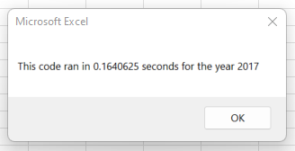
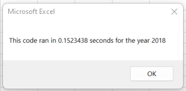

# Stock Analysis

## <ins>Overview of Project</ins>
### The purpose of this project was to refactor the code we were working with to make it more efficient and run faster. This way, our client Steve, can expand the dataset he is working with and not worry about the code taking an extended amount of time to execute.

## <ins>Results</ins>
### By refactoring our code, the running time for the code when looking at the 2017 dataset was 0.5820313 seconds faster than with our original code.

### The running time for the code when looking at the 2018 dataset also decreased running time by 0.6914062 seconds.

## <ins>Summary</ins>
### There are a few advantages and disadvantages to refactoring code, one of the advantages is creating a more efficient code that will run in less time and be able to handle larger datasets without taking an eternity to execute. Another advantage is refactoring code sometimes makes the code easier without changing the functionality. A disadvantage I can see is sometimes changing code can produce errors or bugs that were not in the code before and working through a refactored code and debugging at the same time may be more time consuming for the person refactoring. While going through this challenge, I saw these advantages and disadvantage, the refactored code I worked through did have a faster running time but while I was working through the code some of the changes, I made created bugs which I had to figure out the cause for and make new changes.  
